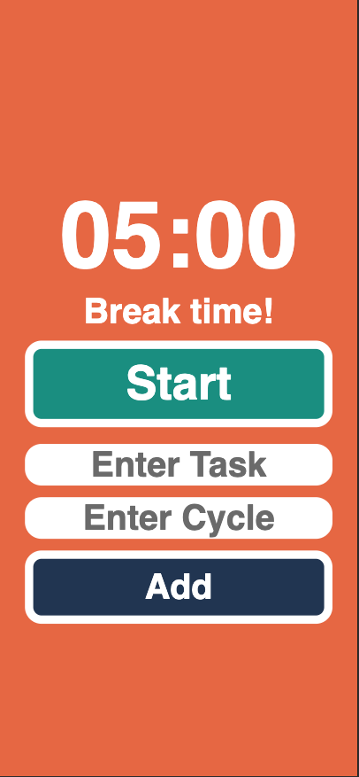

# 🕒 Jia Pomo - 番茄時鐘計時器

提升專注力的番茄工作法應用，每個循環 25 分鐘，幫助你集中精神，規劃任務與休息時間。

---

## 🚀 安裝方式

```bash
git clone https://github.com/jiawu777/jia-pomo.git
cd jia-pomo
npm install
```

## 📘 使用方式

- 輸入任務名稱
- 輸入任務循環次數（每次循環 25 分鐘）
- 每次循環結束後會自動休息 5 分鐘

---

## 🌐 部署連結

🔗 [https://jia-pomo.vercel.app/](https://jia-pomo.vercel.app/)

---

## 📌 功能特色

- ⏱️ 番茄計時循環（25 分鐘工作 / 5 分鐘休息）
- 📝 任務命名與循環設定
- 🧼 清晰簡潔的介面

---

## 🛠 技術棧

- ⚛️ **React**
- 🟦 **TypeScript**
- ⚡ **Vite**
- 🎨 **SCSS**
- 🧪 **Jotai** 狀態管理

---

## 📸 頁面截圖

### 🌟 首頁頁面（Pomodoro）


### 📜 手機模式休息頁面


